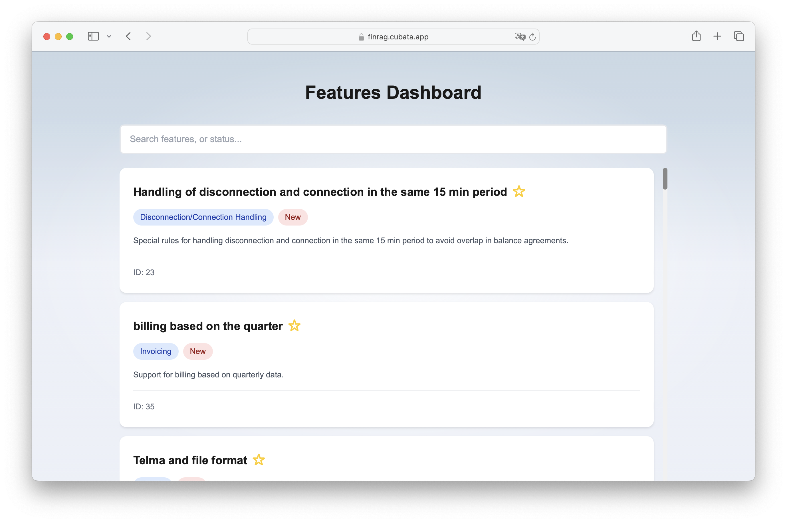

<h1 align="center">FinRAG</h1>

A  customer interaction platform designed to address the needs of Fingrid's clients.
We provide a more transparent and user-friendly interface to allow clients to easily track upcoming system versions, feature requests, and updates.

<p align="center">
  
  
</p>

<p align="center">
  
  
</p>

## Problem Statement

Fingrid Datahub's system development is highly impactful for the energy sector, and the development work directly affects their clients.
However, many clients find it difficult to follow up on their feature requests or to obtain an overview of system updates and new releases.

Currently, the information process consists of newsletters and downloadable files.

We aim to create a prototype that resolves these pain points by providing a customizable frontend experience.
The platform should make it easier for clients to stay informed and track updates in real-time.
We additionally provide an internal view for Fingrid to track and monitor popular features.

## Approach

To solve the problem, we used the following approach:

1. **Feature Extraction**: RAG based pipeline to extract features from PDF documents using Mistral LLMs, adding tags and ids to each different feature.
2. **Data Processing**: The extracted feature data is processed and structured into a more user-friendly format.
3. **Frontend Implementation**: A SvelteKit web app was created to allow users to easily navigate and explore the different features.

## Project Structure

We containerized everything using Docker and use Docker Compose to get everything up and running.

### Backend

-   **Processing**: Handles data extraction and transformation from raw PDF files to structured data.
-   **Database**: Stores the feature data and metadata.
-   **API**: Using FastAPI to easily get the data.

#### Backend Directory

```
back
├── api
│   ├── Dockerfile
│   ├── main.py
│   ├── requirements.txt
│   └── src
│       ├── db.py
│       └── models.py
├── db
│   └── schema.sql
└── processing
    ├── llm_analyzer.py
    ├── mistral_analyzer.py
    ├── pdf_parser.py
    └── pdf_scrapper.py
```

### Frontend

The frontend of the project is implemented using SvelteKit and provides a user-friendly interface to explore the features and updates.
It displays the data fetched from the backend and allows users to interact with the features in a meaningful way.

#### Frontend Directory

```
front
├── src
│   ├── lib
│   │   └── images
│   └── routes
│       ├── ball
│       ├── feature
│       │   └── [id]
│       └── internal
└── static
    └── pdfs
```

## Quickstart

To set up everything using docker use

```docker-compose up -d --build```

Or simply

```make```


